# 接单吧 OPC（超级个体）操作手册

> **版本**：V1.0 · 2026年4月  
> **适用对象**：已通过平台认证的 OPC（超级个体）用户  
> **平台网址**：[接单吧 - OPC撮合交易平台](/)

---

## 目录

1. [平台简介与角色说明](#一平台简介与角色说明)
2. [账号登录与注册](#二账号登录与注册)
3. [首页仪表盘](#三首页仪表盘)
4. [订单大厅](#四订单大厅)
5. [需求详情与立即接单](#五需求详情与立即接单)
6. [我的订单工作台](#六我的订单工作台)
7. [订单详情](#七订单详情)
8. [个人中心](#八个人中心)
9. [案例作品集](#九案例作品集)
10. [培训进阶](#十培训进阶)
11. [收入结算](#十一收入结算)
12. [结算账户](#十二结算账户)
13. [社区](#十三社区)
14. [消息中心](#十四消息中心)
15. [争议处理](#十五争议处理)
16. [平台规则与注意事项](#十六平台规则与注意事项)
17. [常见问题 FAQ](#十七常见问题-faq)

---

## 一、平台简介与角色说明

**接单吧**是面向 OPC（超级个体）与企业需求方的智能撮合交易平台，由海创元数字交易中心运营。平台以"连接需求方与超级个体"为核心使命，通过 AI 智能匹配、里程碑交付机制和机构级资金托管，为企业数字化转型提供高质量的专业服务。

### 平台三大核心角色

| 角色 | 定义 | 主要职责 |
|------|------|----------|
| **OPC（超级个体）** | 经平台认证的专业服务提供方，具备 AI、运营、教育等垂直领域能力 | 接单、交付项目、获取收益 |
| **发单方（Publisher）** | 有数字化需求的政府机构、企业或组织 | 发布需求、审核交付、结算付款 |
| **平台管理员（Admin）** | 海创元平台运营人员 | 审核账号、调解争议、维护平台秩序 |

> **本手册仅针对 OPC 用户角色**。如您是发单方，请参阅发单方操作手册；管理员请联系平台技术支持获取后台操作指南。

### OPC 等级体系

OPC 分为三个认证等级，等级越高可接取项目价值越大：

| 等级 | 代号 | 定位 |
|------|------|------|
| **新手** | C级 | 刚入驻平台，接受标准任务，建立服务记录 |
| **进阶** | B级 | 具备中高价值项目服务能力，可参与定向邀约 |
| **专家** | A级 | 顶级服务能力，定向邀请高端政企项目 |

### 交易保障机制

- **资金托管**：发单方付款后资金由平台全额托管，交付验收通过后才释放给 OPC，双方均无法单方面挪用。
- **里程碑交付**：所有项目按阶段拆分里程碑，降低大额单次交付风险，保障双方权益。
- **平台调解**：如出现争议，平台管理员将在 48 小时内介入，5 个工作日内给出调解结论。

---

## 二、账号登录与注册

### 登录步骤

1. 打开平台首页，点击右上角「登录」按钮，或直接访问 `/login` 页面。
2. 在登录表单中输入您的**邮箱或手机号**和**密码**。
3. 点击「登录 →」按钮，系统验证成功后自动跳转到首页。

> **提示**：OPC、发单方、管理员均通过同一入口登录。登录后系统会根据账号角色自动进入对应的工作台界面。

### 注册账号

- 点击「立即注册 →」可前往注册页面，填写基本信息完成账号创建。
- 新账号注册后默认为 **C级·新手** OPC，可通过完成培训课程和实际任务逐步升级。

### 忘记密码

- 在登录表单页点击「忘记密码？」链接，按提示通过邮箱或手机号验证后重置密码。

---

## 三、首页仪表盘

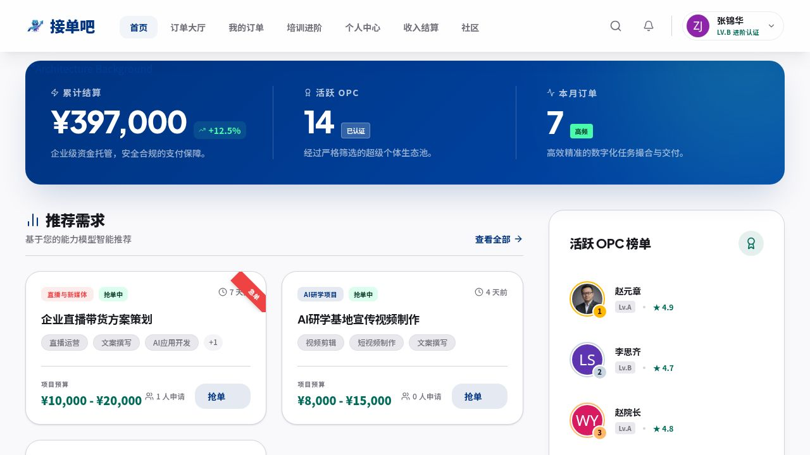

登录后默认进入首页，这里是您的**数据总览与任务快速入口**。

### 核心数据面板

页面顶部的蓝色横幅展示三项关键指标：

| 指标 | 说明 |
|------|------|
| **累计结算** | 您在平台历史总结算金额，附带同比增长率 |
| **活跃 OPC** | 当前平台活跃的已认证超级个体总数 |
| **本月订单** | 本月平台撮合成功的订单数量，标注频率（高频/普通） |

### 推荐需求

- 系统根据您的**能力模型**智能推荐匹配度最高的需求，帮助您优先发现高价值机会。
- 每张需求卡片显示：需求类型标签、预算范围、截止时间、当前申请人数及「抢单」按钮。
- 点击「查看全部 →」可跳转至订单大厅查看完整需求列表。

### 活跃 OPC 榜单

- 右侧边栏展示平台活跃度排名前列的 OPC，包含头像、等级和综合评分。
- 榜单以活跃度积分为准，每月动态更新，高排名有助于获得更多定向邀约。

### 市场洞察

- 首页底部提供「AI市场需求洞察」模块，展示当前热门需求方向，可下载完整市场报告。

---

## 四、订单大厅

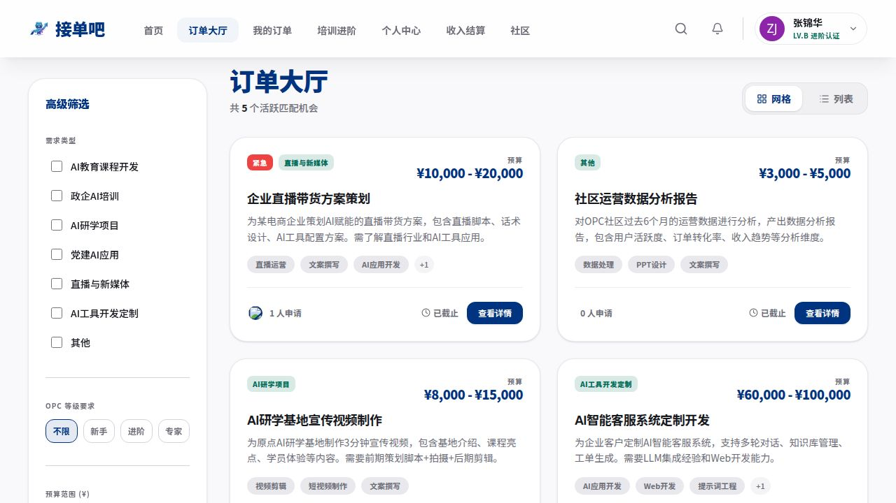

订单大厅是平台上所有**公开可接需求**的汇聚地，共 5 个活跃匹配机会（数量实时更新）。

### 筛选功能

左侧「高级筛选」侧边栏提供多维度过滤：

| 筛选维度 | 可选项 |
|----------|--------|
| **需求类型** | AI教育课程开发、政企AI培训、AI研学项目、党建AI应用、直播与新媒体、AI工具开发定制、其他 |
| **OPC等级要求** | 不限 / 新手（C级）/ 进阶（B级）/ 专家（A级） |
| **预算范围** | 自定义最低/最高金额区间 |
| **截止日期** | 按需求方设定的交付截止日期过滤 |

### 视图切换

右上角可切换**网格视图**（默认）和**列表视图**，网格视图信息更直观，列表视图适合快速扫描。

### 需求卡片解读

每张需求卡片包含以下信息：

- **紧急标签**：标注为「紧急」的需求时效性更强，建议优先处理。
- **需求类型**：如「直播与新媒体」「AI研学项目」等分类标签。
- **预算范围**：如 ¥10,000 - ¥20,000。
- **需求标题与摘要**：简要说明项目内容和要求。
- **技能标签**：匹配该需求所需的技能关键词。
- **申请人数**：当前已提交申请的 OPC 数量。
- **截止状态**：显示距截止日期的剩余天数或「已截止」状态。

点击「查看详情」进入需求详情页了解完整信息并提交申请。

---

## 五、需求详情与立即接单

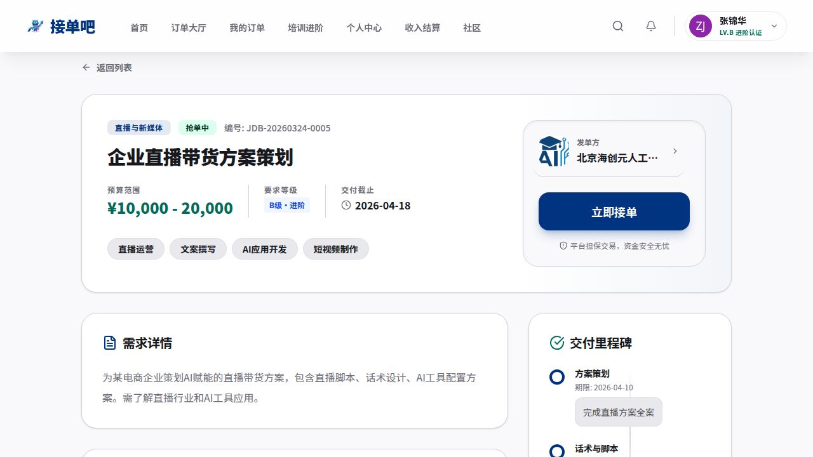

点击订单大厅中的任意需求卡片后进入需求详情页，这里展示了该需求的完整信息，并提供接单入口。

### 需求头部信息

- **编号**：平台唯一编号（如 `JDB-20260324-0005`），用于客服沟通或纠纷申诉。
- **状态标签**：如「抢单中」「已截止」等，反映当前接单状态。
- **需求类型**：行业分类标签。
- **预算范围**：发单方设定的项目报价区间。
- **要求等级**：完成该需求所需的 OPC 最低认证等级（如 B级·进阶）。
- **交付截止**：项目最终交付的硬性截止日期。

### 发单方信息

右上角卡片展示发单方信息（如企业名称），点击可查看企业详情弹窗，包括：企业简介、所属行业、团队规模、往期合作评价等，帮助您评估合作方资质。

### 立即接单

确认需求内容后，点击「**立即接单**」按钮提交申请：

1. 系统弹出报价表单，填写您的**报价金额**、**预计交付天数**和**相关作品集链接**。
2. 提交后平台将进行 AI 智能匹配，发单方审核后决定是否签约。
3. 「平台担保交易，资金安全无忧」——所有项目资金由平台托管，交付验收后结算。

> **注意**：等级不符合要求的需求无法提交申请，请先通过培训升级至对应等级。

### 需求详情

- **需求详情**：发单方对项目的完整描述，包括背景、目标、具体要求和参考信息。
- **交付里程碑**：项目分阶段的里程碑节点（如「方案策划」「话术与脚本」），每个阶段标注期限和具体交付物要求。
- **附件资料**：发单方上传的参考文件，可直接下载查看。

---

## 六、我的订单工作台

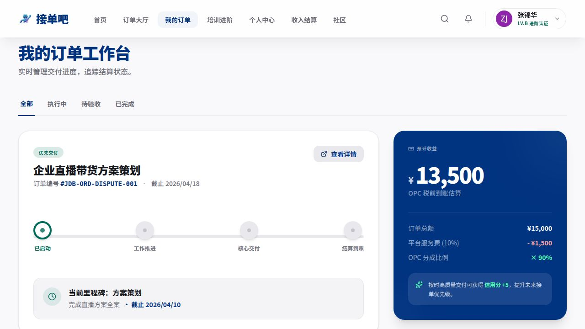

「我的订单」是您管理所有进行中和历史订单的核心工作台，实时追踪交付进度和结算状态。

### 状态分类

顶部标签页按订单状态分类：

| 标签 | 说明 |
|------|------|
| **全部** | 显示所有订单，不限状态 |
| **执行中** | 当前正在执行的项目，需按时完成各里程碑 |
| **待验收** | 您已提交交付物，正在等待发单方验收确认 |
| **已完成** | 验收通过、结算完毕的历史订单 |

### 订单卡片功能

每个订单卡片包含：

- **进度步进条**：可视化展示四个阶段（开始 → 执行 → 交付 → 结算）的当前位置。
- **当前里程碑信息**：高亮显示当前阶段的任务内容及截止时间。
- **交付工作台**：支持通过链接或文件包提交交付成果（代码包、交付文档等）。
- **提交记录**：查看历次提交内容及发单方的审核结果（通过/驳回）。

> 若订单列表为空，说明您尚未接取任何需求，请前往「订单大厅」抢单。

---

## 七、订单详情

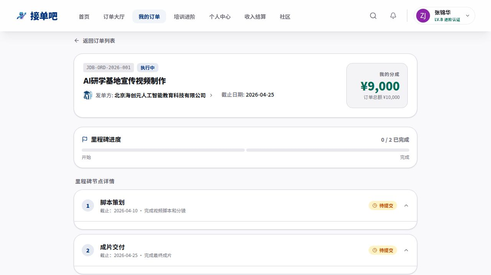

订单详情页提供单个项目的全生命周期追踪，从签约到完成的每个节点均有记录。

> 访问路径：「我的订单」列表 → 点击任意订单卡片进入详情。

### 里程碑卡片

- 每个里程碑节点可展开，查看：
  - 该阶段的历史提交记录。
  - 发单方的审核反馈和驳回原因（若有）。
  - 已返工次数及剩余返工额度。
- 在当前待完成节点可直接填写交付物信息（标题、描述、URL 链接）并提交。

### 财务明细

- **订单总金额**：合同约定的完整报酬。
- **我的到手金额**：扣除平台服务费后的实际收入（OPC 分成比例为订单金额的 **90%**）。

### 完成评价

订单完成后，您可以对发单方进行星级评分和文字评价，有助于维护平台的交易信用生态。

---

## 八、个人中心

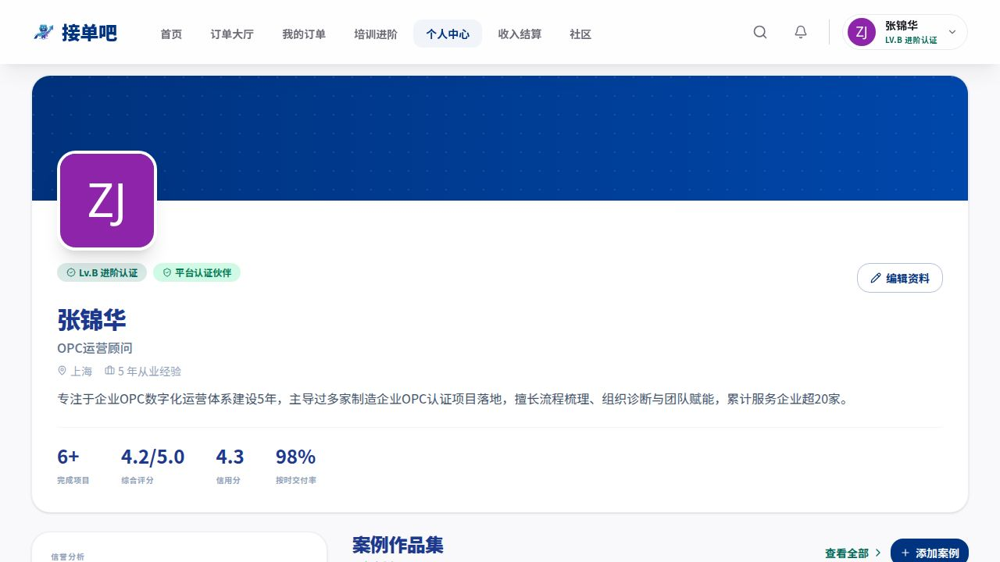

个人中心是您的**专业品牌主页**，展示认证等级、职业信息、技能标签和历史成绩，发单方在考察 OPC 时会重点查看此页面。

### 个人信息卡片

- **头像**：支持上传自定义头像，系统提供在线裁剪工具。
- **认证等级徽章**：如「Lv.B 进阶认证」。
- **平台认证伙伴标识**：通过平台完整认证的官方标识，提升发单方信任度。
- **基本信息**：姓名、职业标题（如「OPC运营顾问」）、所在城市、从业年限。
- **个人简介**：展示您的专业能力和服务亮点，建议精心撰写以吸引高价值项目。

### 核心数据

| 指标 | 说明 |
|------|------|
| 完成项目 | 累计成功交付的项目数量 |
| 综合评分 | 发单方对所有完成项目的平均评分（满分 5.0） |
| 信用分 | 平台信用体系评分，影响接单优先级 |
| 按时交付率 | 历史订单按时完成里程碑的比率 |

### 编辑个人资料

点击右上角「编辑资料」按钮，打开编辑侧边栏：

- 修改头像、昵称、职业标题、城市、从业年限、个人简介。
- **AI辅助技能选择**：系统根据您的简介和历史项目，智能推荐技能标签供选择。
- 添加/删除技能标签，构建专属技能云图。

### 认证等级历史

页面底部展示认证升级时间轴，记录从 C级（新手）到 B级（进阶）再到 A级（专家）的完整认证历程。

---

## 九、案例作品集

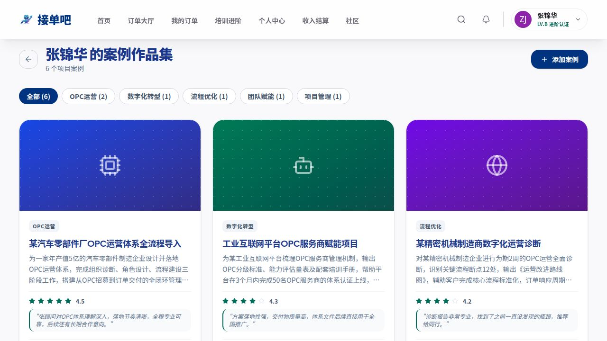

案例作品集是您向发单方展示实际服务能力的**项目橱窗**，高质量的案例有助于在竞争中脱颖而出。

### 分类筛选

顶部提供分类标签（如「OPC运营」「数字化转型」「流程优化」「团队赋能」「项目管理」），可按类型过滤展示。

### 案例卡片

每张作品集卡片展示：

- **封面图**：项目相关图片或系统默认分类图标。
- **项目分类标签**：标注项目所属领域。
- **项目标题与摘要**：简要描述项目背景、规模和主要成果。
- **综合评分**：发单方对该项目的评分（1-5星）。
- **客户评价摘录**：发单方真实反馈，增强可信度。

### 添加 / 编辑案例

点击右上角「+ 添加案例」按钮：

1. 填写项目标题、所属分类、项目描述（重点突出交付成果和客户价值）。
2. 上传项目封面图，或填写外部展示链接（如在线文档、演示视频 URL）。
3. 保存后案例即刻展示在您的作品集页面。

> **建议**：至少维护 3-5 个高质量案例，每个案例描述控制在 150-300 字，突出量化成果。

---

## 十、培训进阶

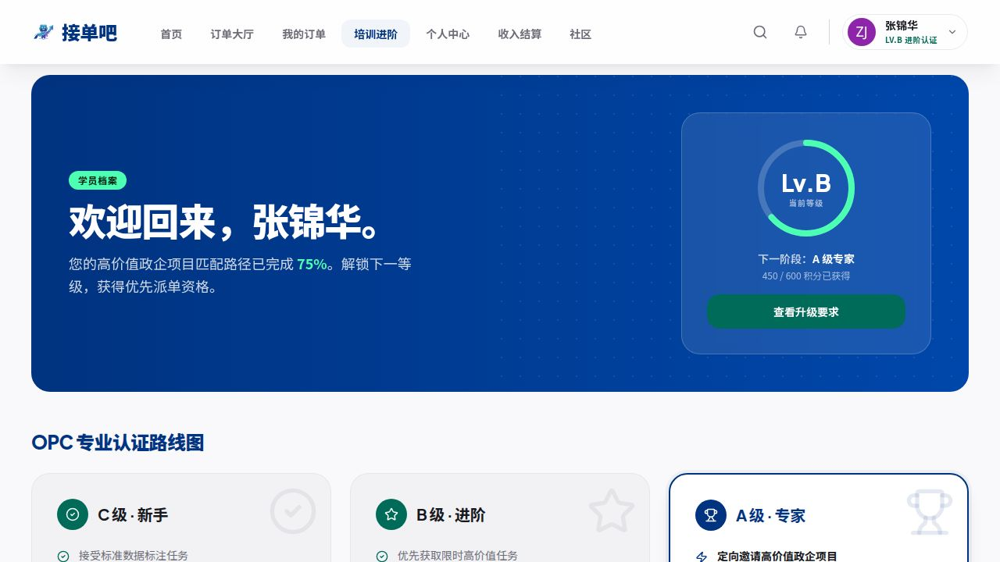

培训进阶中心是 OPC 提升等级、解锁更高价值项目资质的**官方学习平台**。

### 当前等级与升级路径

页面顶部的蓝色横幅显示：

- **当前等级**：圆形进度图（如 Lv.B）和当前积分进度（如 450/600）。
- **下一阶段**：升级目标等级（如 A级·专家）及升级进度百分比。
- 点击「查看升级要求」了解完整的升级任务清单。

### OPC 专业认证路线图

| 等级 | 特权 |
|------|------|
| **C级·新手** | 接受标准数据标注任务，参与平台基础课程 |
| **B级·进阶** | 优先获取限时高价值任务，可参与定向邀约 |
| **A级·专家** | 定向邀请高价值政企项目，一对一专属支持 |

### 课程库

- 课程卡片展示：课程名称、适用等级（难度标签）、时长（小时）、价格。
- 免费课程可直接点击加入学习；付费课程完成购买后解锁，支持扫码支付。

### 学习进度

- 已报名课程显示圆形进度指示器和「继续学习」按钮，方便随时续学。
- 完成课程可获得积分，积分累积有助于等级升级。

---

## 十一、收入结算

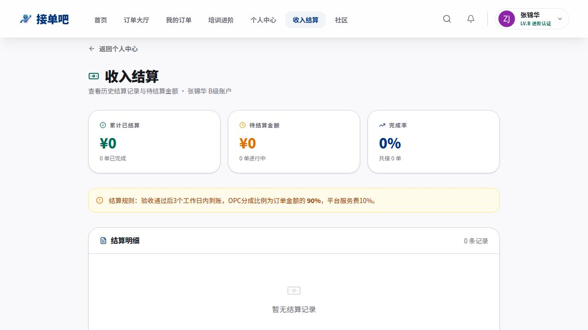

收入结算页面让您清晰掌握**资金状态**，追踪每笔订单的到账情况。

### 核心指标

| 指标 | 说明 |
|------|------|
| **累计已结算** | 历史所有已到账的总金额 |
| **待结算金额** | 已验收但尚未到账的资金（含进行中订单） |
| **完成率** | 成功完成并结算的订单占全部接单的比率 |

### 结算规则

> 验收通过后 **3个工作日内**到账。OPC 分成比例为订单金额的 **90%**，平台服务费 **10%**。

### 结算明细

- 展示每笔结算记录：订单名称、结算状态、订单总金额、您的到账金额。
- 支持按时间范围、结算状态筛选，便于财务对账。

> **注意**：若结算账户未完成实名认证，资金将暂时冻结。请确认完成「结算账户」的资质填写。

---

## 十二、结算账户

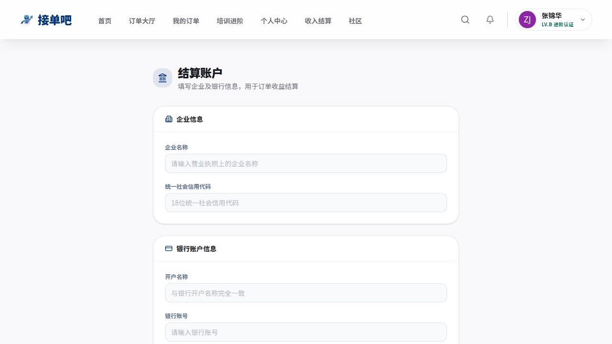

结算账户用于绑定您的**企业银行信息**，平台结算资金将直接打入该账户。

### 企业信息

| 字段 | 要求 |
|------|------|
| 企业名称 | 与营业执照一致的全称 |
| 统一社会信用代码 | 18位标准代码 |

### 银行账户信息

| 字段 | 要求 |
|------|------|
| 开户名称 | 与银行开户资料完全一致 |
| 银行账号 | 对公账户号码 |
| 开户行名称 | 精确到支行 |

### 联系人信息

填写财务负责人的姓名和联系方式，用于结算异常时的沟通。

### 认证状态

账户信息提交后进入「待审核」状态，平台将在 1-3 个工作日内完成审核：

- ✅ **已认证**：资金可正常结算，银行卡图标变为绿色。
- ⚠️ **驳回**：请按照驳回原因修正信息后重新提交。

> **重要提示**：企业信息必须真实有效，与营业执照一致，否则将影响结算。

---

## 十三、社区

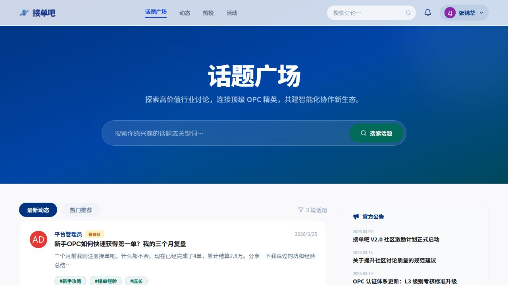

社区是 OPC 与发单方**交流经验、获取资讯**的互动空间，设有话题广场、动态、热榜、活动等板块。

### 话题广场

- **最新动态**：按时间倒序展示所有最新帖子。
- **热门推荐**：按点赞量和互动热度排序的精选内容。
- 每条帖子显示：作者头像、角色标签（OPC/发单方/管理员）、发布时间、标题摘要、标签和互动数据。

### 搜索话题

顶部搜索框支持按关键词搜索感兴趣的话题或讨论，快速定位相关内容。

### 官方公告

右侧边栏汇聚平台最新的官方公告和政策更新，建议定期查看以获取平台动态。

### 发布帖子

点击「发布」按钮，填写标题、正文内容，添加话题标签后提交。

> **注意**：系统内置内容安全过滤，禁止在社区内留个人联系方式或分享私下交易信息，违规内容将被自动屏蔽。

---

## 十四、消息中心

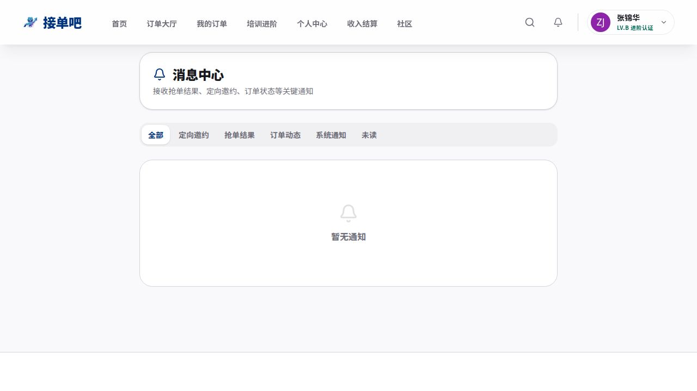

消息中心集中管理所有**平台通知和业务提醒**，确保您不错过任何重要信息。

### 消息分类

| 类别 | 内容说明 |
|------|----------|
| **全部** | 查看所有未读和历史通知 |
| **定向邀约** | 发单方主动邀请您参与特定项目，可直接接受或婉拒 |
| **抢单结果** | 您的申请审核结果通知（通过/未通过） |
| **订单动态** | 订单状态变化（如：验收通过、里程碑到期提醒、驳回反馈） |
| **系统通知** | 平台升级公告、账户安全提醒等官方通知 |
| **未读** | 仅显示尚未查阅的新消息 |

### 定向邀约处理

收到发单方的定向邀约时，消息卡片上会显示「**接受**」和「**婉拒**」按钮，请在有效期内及时回复，超时将自动视为婉拒。

### 一键已读

点击消息中心右上角「全部已读」，可将所有未读通知批量标记为已读，清理消息角标。

---

## 十五、争议处理

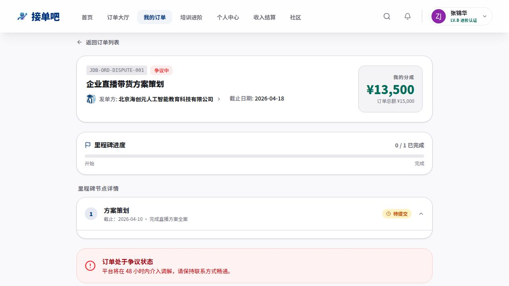

上图展示了一个处于「争议中」状态的订单（订单号 JDB-ORD-DISPUTE-001），页面底部显示平台介入调解的红色提示横幅。当项目执行过程中与发单方产生分歧无法协商解决时，OPC 可通过平台发起争议调解申请，由平台介入保障双方权益。

### 争议触发场景

以下情形可发起争议申请：

- 发单方多次无故驳回符合要求的交付物。
- 发单方要求超出合同范围的额外工作而不额外付款。
- 发单方单方面中止项目且拒绝支付已完成部分的报酬。
- 双方对交付物质量标准产生实质性争议，无法通过沟通解决。

### 申请调解流程

1. **进入订单详情页**：在「我的订单」中找到存在争议的订单，点击进入详情页。
2. **发起争议申请**：在订单详情页底部找到「发起争议」入口，点击后填写争议原因和相关说明。
3. **提交证据材料**：上传能证明您完成交付的截图、文件、沟通记录等证据。
4. **进入调解状态**：提交后订单状态切换为「争议中」（红色警示横幅），平台将在 **48小时内**介入调解，请保持联系方式畅通。
5. **等待调解结果**：平台审核双方提交的证据后，将在 **5个工作日内**给出调解结论：
   - 认定 OPC 权益受损 → 托管资金按比例释放给 OPC。
   - 认定交付不达标 → 退回资金给发单方，并记录 OPC 违约信息。

### 注意事项

- 争议状态下订单资金继续由平台**全额托管**，双方均无法单方面提取。
- 请在争议申请中**提供完整的沟通记录截图**，这是平台判定的核心依据。
- 恶意发起争议（无合理理由）将影响您的**信用分**，严重情况下可能暂停接单资格。
- 平台鼓励双方在申请争议前先通过订单内置消息充分沟通，大多数分歧可通过沟通解决。

---

## 十六、平台规则与注意事项

### 交易安全

- 所有项目资金由**平台全程托管**，验收通过后方可结算，确保双方资金安全。
- 严禁任何形式的线下私下交易，否则将取消账号资格并不予保障资金安全。

### 结算规则

- OPC 完成交付、发单方确认验收后，**3个工作日内**资金到账。
- 平台服务费为订单金额的 **10%**，OPC 实际到手 **90%**。

### 纠纷处理

- 如与发单方产生分歧，请通过平台内置的申诉渠道提交争议，并提供完整的沟通记录和交付物截图。
- 平台将在 **5个工作日内**介入调解，保障 OPC 的合法权益。

### 等级与权益

| 等级 | 可接需求类型 | 核心特权 |
|------|------------|----------|
| C级·新手 | 标准任务 | 参与基础课程，建立接单记录 |
| B级·进阶 | 中高价值任务 | 获取限时高价值需求推送，参与定向邀约 |
| A级·专家 | 高端政企项目 | 定向邀请顶级项目，专属运营支持 |

### 账号安全

- 请妥善保管登录密码，定期修改以保障账号安全。
- 如发现账号异常登录，请立即联系平台客服冻结账号。

---

## 十七、常见问题 FAQ

### 登录与账号

**Q：忘记密码怎么办？**  
A：点击登录页「忘记密码？」链接，通过注册邮箱或手机号验证后可重置密码。如验证码长时间未收到，请检查垃圾邮件文件夹或联系客服。

**Q：可以用同一个账号同时作为 OPC 和发单方吗？**  
A：不可以。OPC 和发单方是独立角色，需要分别注册账号。

---

### 接单与投标

**Q：我的等级不够，看到合适需求但无法投标，怎么办？**  
A：前往「培训进阶」页面查看升级要求，完成指定课程和任务后积分达标即可升级。升级后将自动解锁对应等级的需求接单资格。

**Q：提交投标申请后多久会有结果？**  
A：发单方通常会在需求截止日期前 1-3 天完成审核。您可以在「消息中心 → 抢单结果」分类查看审核通知。

**Q：投标时需要提供什么？**  
A：报价金额、预计交付天数，以及相关案例作品集链接（强烈建议提供，有助于提升中标率）。

---

### 订单执行

**Q：发单方驳回了我的交付物，但我认为已符合要求，怎么处理？**  
A：首先在订单内置消息中与发单方沟通，了解具体驳回理由并协商解决。若沟通无效且多次驳回，可在订单详情页发起争议申请，由平台介入调解。

**Q：里程碑快到期了，但工作还没完成，怎么办？**  
A：建议提前告知发单方并协商延期。平台支持双方协议延期，发单方同意后可在后台调整截止日期。无法协商时建议提交现有成果并注明进度，避免直接违约。

**Q：交付物支持哪些格式？**  
A：平台支持通过**URL 链接**（如在线文档、GitHub 仓库、视频链接）或**文件包上传**两种方式提交交付物。建议使用云存储链接以确保发单方能顺畅访问。

---

### 收款与结算

**Q：什么时候钱会到账？**  
A：发单方确认验收通过后，平台将在 **3个工作日内**将资金划入您绑定的结算账户。

**Q：为什么结算金额比合同金额少？**  
A：平台收取 **10%** 服务费，您实际到手金额为合同金额的 **90%**。例如合同金额 ¥10,000，到手 ¥9,000。

**Q：结算账户信息填错了怎么办？**  
A：前往「结算账户」页面修改信息并重新提交审核。注意：修改期间如有待结算资金，会在新账户审核通过后再行结算。

---

### 认证与升级

**Q：C级升B级需要满足哪些条件？**  
A：通常需要完成指定培训课程、在平台成功交付一定数量的项目，并保持信用分达标。具体要求请查看「培训进阶」页面的升级路线图。

**Q：信用分低了会有什么影响？**  
A：信用分影响您在搜索结果中的排名优先级和定向邀约的获取频率。严重违规（如无故毁约、恶意争议）可能导致接单资格暂停。

---

### 其他

**Q：平台有没有官方客服？**  
A：可通过「社区」发帖提问，管理员和资深 OPC 会协助解答；也可通过平台页面右下角的客服入口联系在线客服（服务时间：工作日 9:00-18:00）。

**Q：在社区里能联系到发单方直接合作吗？**  
A：平台禁止在社区内进行私下交易，所有合作必须通过平台撮合并签约，以保障双方的资金安全和合法权益。

---

*本手册持续更新，如有疑问请以平台最新公告为准。*

*© 2026 海创元数字交易中心. 保留所有权利.*
