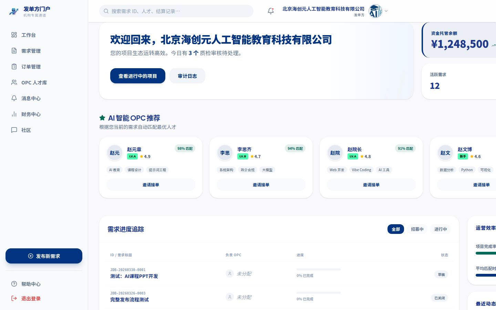
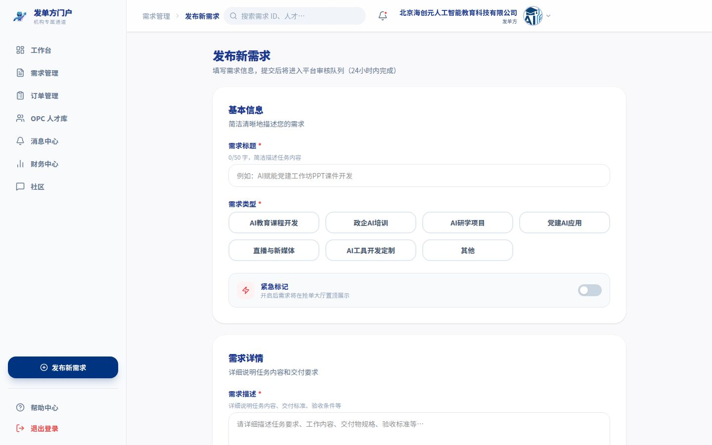
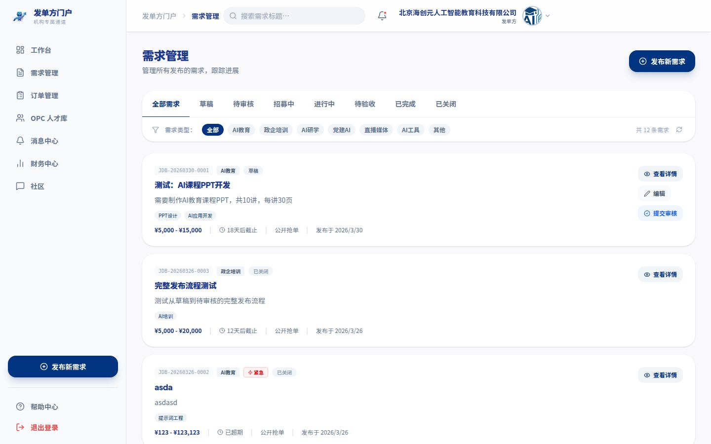
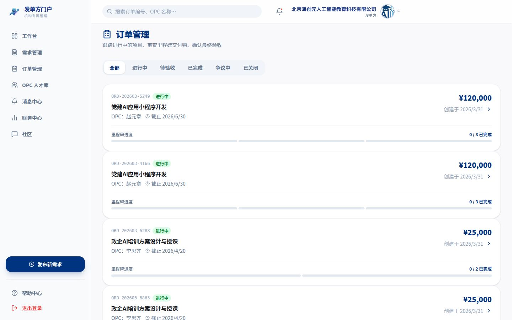
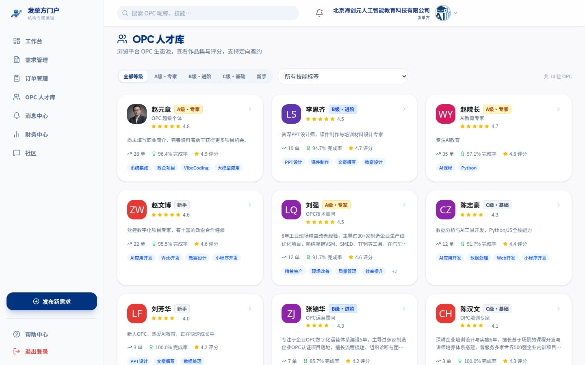
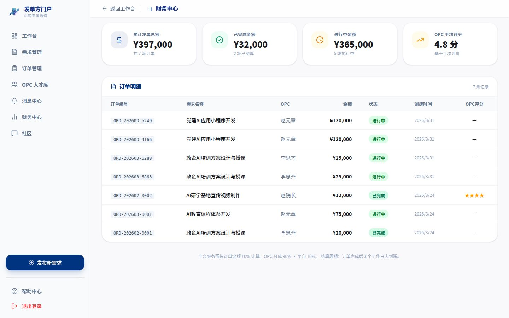
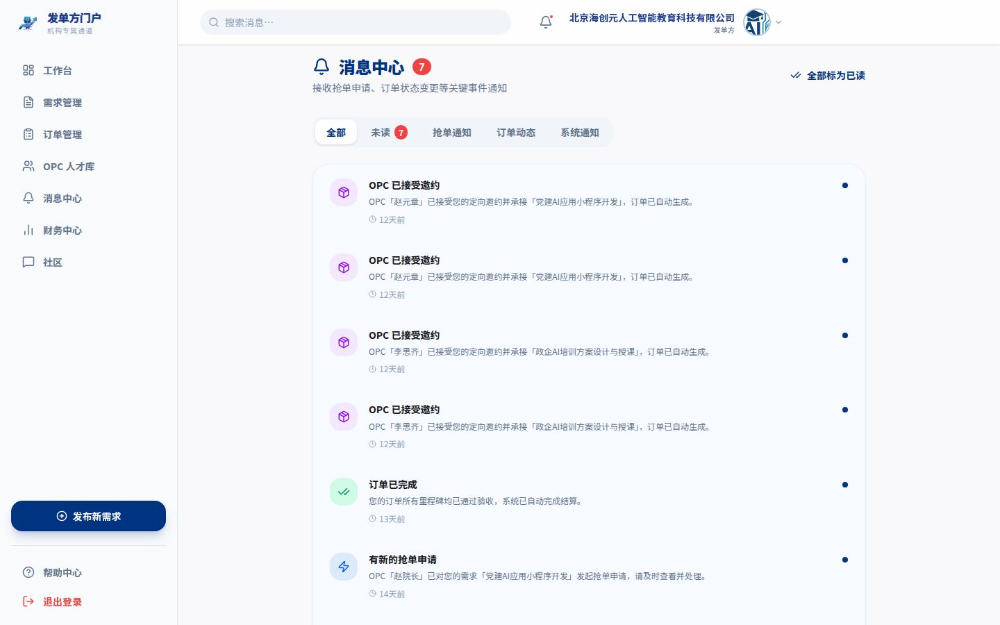

# 接单吧 发单方（Publisher）操作手册

> **版本**：V1.0 · 2026年4月  
> **适用对象**：在平台发布需求的政府机构、企业及组织用户  
> **平台网址**：[接单吧 - OPC撮合交易平台](/)

---

## 目录

1. [平台简介与发单方角色说明](#一平台简介与发单方角色说明)
2. [账号登录与注册](#二账号登录与注册)
3. [发单方首页控制台](#三发单方首页控制台)
4. [发布新需求](#四发布新需求)
5. [需求管理](#五需求管理)
6. [需求详情与选标](#六需求详情与选标)
7. [订单管理](#七订单管理)
8. [订单详情与验收](#八订单详情与验收)
9. [OPC 人才库](#九opc-人才库)
10. [财务中心](#十财务中心)
11. [个人中心](#十一个人中心)
12. [消息中心](#十二消息中心)
13. [争议处理](#十三争议处理)
14. [平台规则与注意事项](#十四平台规则与注意事项)
15. [常见问题 FAQ](#十五常见问题-faq)

---

## 一、平台简介与发单方角色说明

**接单吧**是面向 OPC（超级个体）与企业需求方的智能撮合交易平台，由海创元数字交易中心运营。平台以"连接需求方与超级个体"为核心使命，通过 AI 智能匹配、里程碑交付机制和机构级资金托管，为企业数字化转型提供高质量的专业服务。

### 平台三大核心角色

| 角色 | 定义 | 主要职责 |
|------|------|----------|
| **发单方（Publisher）** | 有数字化需求的政府机构、企业或组织 | 发布需求、审核交付、结算付款 |
| **OPC（超级个体）** | 经平台认证的专业服务提供方 | 接单、交付项目、获取收益 |
| **平台管理员（Admin）** | 海创元平台运营人员 | 审核账号、调解争议、维护平台秩序 |

> **本手册专为发单方用户撰写**。如您是 OPC，请参阅《接单吧 OPC 操作手册》。

### 发单方核心权益

- **精准匹配**：AI 系统根据需求标签、预算和等级要求，在平台 OPC 生态池中智能匹配最合适的超级个体。
- **资金安全**：付款后资金由平台全程托管，交付验收通过后才释放给 OPC，发单方享有完整的资金保障。
- **里程碑管控**：项目按阶段拆分里程碑，发单方可逐阶段审核交付物，全程掌控项目进度。
- **争议保障**：如交付不符合要求，可发起争议申请，平台 48 小时内介入调解。

### 交易保障机制

| 机制 | 说明 |
|------|------|
| **资金托管** | 发单方付款后资金由平台托管，验收通过后才释放，双方均无法单方面挪用 |
| **里程碑交付** | 项目分阶段推进，降低大额单次交付风险 |
| **平台调解** | 争议发生时，平台 48 小时内介入，5 个工作日内给出调解结论 |

---

## 二、账号登录与注册

### 登录步骤

1. 打开平台首页，点击右上角「登录」按钮，或直接访问 `/login` 页面。
2. 在登录表单中输入您的**邮箱或手机号**和**密码**。
3. 点击「登录 →」按钮，系统验证成功后自动跳转至发单方控制台。

> **提示**：OPC、发单方、管理员均通过同一入口登录，系统根据账号角色自动跳转至对应工作台。

### 注册账号

- 点击「立即注册 →」，选择身份为**发单方**，填写企业基本信息完成账号创建。
- 注册完成后可直接使用发单方功能，无需等级审核。

### 忘记密码

- 点击登录表单页「忘记密码？」链接，按提示通过邮箱或手机号验证后重置密码。

---

## 三、发单方首页控制台

登录后默认进入发单方首页，这里是您的**需求概览与快速操作中心**。

### 核心数据面板

页面顶部展示三项关键业务指标：

| 指标 | 说明 |
|------|------|
| **进行中需求** | 当前状态为"进行中"的项目数量 |
| **活跃 OPC 总数** | 平台当前活跃的已认证超级个体数量，反映人才池规模 |
| **平台成功订单** | 平台累计撮合成功的总订单数 |

### 我的需求列表

- 展示您发布的所有需求，按状态分组显示（全部 / 招募中 / 进行中）。
- 每张需求卡片包含：需求名称、类型标签、预算范围、截止日期、当前状态和进度条。
- 点击需求卡片直接进入该需求的详情页查看报名情况和项目进度。

### 快速入口

- 右上角「**+ 发布新需求**」按钮，直接跳转至需求创建表单。
- 侧边导航栏提供各功能模块的快速入口（需求管理、订单管理、OPC 人才库、财务中心、消息中心、个人中心）。

### 活跃 OPC 排行榜

右侧边栏展示平台近期活跃度最高的 OPC，包含头像、等级、综合评分及完成订单数，可作为发起定向邀约的参考。

---

## 四、发布新需求

点击任意位置的「+ 发布新需求」或「+ 发布需求」进入需求创建表单，这是您在平台启动项目合作的起点。

### 填写基本信息

| 字段 | 说明 | 是否必填 |
|------|------|----------|
| **需求标题** | 简洁、清晰的项目名称（10-100字） | ✅ 必填 |
| **需求类型** | AI教育课程开发 / 政企AI培训 / AI研学项目 / 党建AI应用 / 直播与新媒体 / AI工具开发定制 / 其他 | ✅ 必填 |
| **需求描述** | 详细描述项目背景、目标、具体要求（50字以上，建议300字以内） | ✅ 必填 |
| **参考资料** | 可填写外部参考链接，辅助 OPC 理解需求 | 选填 |
| **附件** | 上传 PDF、Word 等参考文档（单文件不超过 20MB） | 选填 |

### 预算与等级设置

| 字段 | 说明 |
|------|------|
| **预算区间** | 填写最低 / 最高预算金额（元），系统据此匹配有资质的 OPC |
| **OPC 等级要求** | 不限 / C级·新手（上限¥3,000）/ B级·进阶（上限¥20,000）/ A级·专家（上限¥200,000） |
| **交付截止日期** | 项目最终交付的硬性截止日期，选择后自动展示给报名 OPC |

> **等级与预算说明**：平台对各等级 OPC 设有接单预算上限，设置等级要求时请确保您的预算区间与该等级上限匹配，否则需求将无法被对应等级 OPC 报名。

### 添加里程碑

里程碑是项目分阶段管控的核心工具，至少需要设置 1 个：

1. 点击「+ 添加里程碑」按钮。
2. 填写：**里程碑名称**（如"方案策划"、"脚本定稿"、"成果验收"）、**交付截止日期**、**交付物描述**（说明该阶段需要 OPC 提交什么内容）。
3. 可继续添加多个里程碑，构成完整的项目路线图。

> **建议**：合理拆分里程碑有助于分阶段验收，降低项目失控风险。通常设置 2-4 个里程碑最为合适。

### 添加技能标签

选择该需求所需的技能关键词（如"PPT设计"、"AI应用开发"、"视频剪辑"等），可多选，用于 AI 精准匹配。

### 提交审核

填写完成后有两个操作选项：

- **保存草稿**：内容暂存为草稿，可随时继续编辑，不公开。
- **提交发布**：提交给平台管理员审核，审核通过后需求即刻向所有符合条件的 OPC 公开招募。

> **注意**：需求进入审核后，等级要求和预算字段将锁定，如需修改请联系管理员先退回草稿。

---

## 五、需求管理

需求管理页面（侧边栏「需求管理」）是您所有发布需求的集中管理中心。

### 状态说明

| 状态 | 含义 |
|------|------|
| **草稿** | 已创建但未提交审核，可继续编辑 |
| **待审核** | 已提交，平台管理员正在审核 |
| **招募中** | 审核通过，公开接受 OPC 报名申请 |
| **进行中** | 已选定 OPC 并开始执行项目 |
| **待验收** | OPC 已提交交付物，等待您确认验收 |
| **已完成** | 所有里程碑验收通过，项目结案 |
| **已关闭** | 需求已关闭（主动关闭或平台强制关闭） |

### 可执行操作

| 操作 | 适用状态 | 说明 |
|------|----------|------|
| **编辑** | 草稿、待审核 | 修改需求内容后重新提交 |
| **发布** | 草稿 | 一键提交审核 |
| **查看详情** | 所有状态 | 进入需求详情页查看报名情况 |
| **关闭需求** | 招募中、待审核 | 停止招募，不再接受新的 OPC 报名 |

---

## 六、需求详情与选标

点击任意需求卡片进入需求详情页，这是您筛选 OPC、查看申请情况并最终选定合作对象的核心页面。

### 报名情况

页面中部展示已报名该需求的所有 OPC 列表，每条记录包含：

- **OPC 头像与昵称**：点击昵称可查看 OPC 的个人主页和作品集。
- **认证等级**：如 C级·新手、B级·进阶、A级·专家。
- **报价金额**：该 OPC 提交的报价。
- **预计交付天数**：OPC 承诺的交付周期。
- **综合评分**：历史项目平均评分（满分 5.0）。
- **操作**：点击「查看详情」可打开 OPC 资料卡，查看作品集、技能标签、历史评价等详细信息。

### 选定 OPC（签约）

对满意的 OPC 点击「选定」按钮后：

1. 系统弹出确认弹窗，提示您的预算将进入平台托管。
2. 确认后需完成**项目预付款**：支持扫码支付，资金进入平台托管账户，OPC 无法直接提取。
3. 支付完成后，需求状态切换为「进行中」，所选 OPC 收到订单确认通知，项目正式启动。

> **重要**：预付款进入托管后，发单方无法单方面退款。如项目出现问题请通过争议申请寻求平台调解。

### 定向邀约

无需等待 OPC 主动报名，您也可以直接向 OPC 人才库中的优质个体发起邀约：

1. 前往「OPC 人才库」页面，浏览 OPC 列表。
2. 找到合适的 OPC 后，点击「发起邀约」，选择对应需求。
3. OPC 将在消息中心收到邀约通知，可选择接受或婉拒。

---

## 七、订单管理

侧边栏「订单管理」展示所有与您相关的项目订单，是追踪项目执行进度的核心工作台。

### 状态分类

| 状态 | 说明 |
|------|------|
| **全部** | 显示所有订单，不限状态 |
| **进行中** | OPC 正在执行项目，您可实时追踪里程碑进度 |
| **待验收** | OPC 已提交交付物，等待您确认 |
| **争议中** | 存在争议，平台正在介入调解 |
| **已完成** | 验收通过、结算完毕的历史订单 |

### 订单卡片信息

每个订单卡片展示：

- **项目名称与编号**：平台唯一订单号（如 `JDB-ORD-20260413-001`）。
- **进度步进条**：可视化显示四个执行阶段（开始 → 执行 → 交付 → 结算）的当前位置。
- **当前里程碑**：高亮显示当前阶段名称和截止时间。
- **OPC 信息**：负责执行该订单的 OPC 头像、昵称和等级。

---

## 八、订单详情与验收

点击订单卡片进入订单详情页，这里是项目全生命周期管控的核心界面。

### 里程碑审核

每个里程碑节点在 OPC 提交交付物后会出现审核入口：

1. **查看交付物**：点击展开里程碑节点，查看 OPC 提交的交付物标题、描述和链接（文件/URL）。
2. **通过验收**：确认交付物符合要求后，点击「通过」按钮，该阶段里程碑标记为完成。
3. **驳回**：若交付物不符合要求，点击「驳回」并填写驳回原因，OPC 将收到通知并重新提交。

> **返工次数**：平台对每个里程碑设有合理返工次数上限。如多次驳回仍无法达到要求，建议通过争议申请寻求平台调解。

### 财务明细

- **订单总金额**：合同约定的完整项目报酬（即托管金额）。
- **平台服务费**：订单金额的 10%，由平台在结算时扣除。
- **OPC 到手**：订单金额的 90%，验收通过后 3 个工作日内打入 OPC 结算账户。

### 全部验收完成后

所有里程碑验收通过后：

- 订单状态切换为「已完成」。
- 平台托管资金在 **3 个工作日内**自动结算至 OPC 银行账户。
- 您可以对本次合作进行**星级评分和文字评价**，评价将展示在 OPC 的个人主页，影响其在平台的信用积分。

---

## 九、OPC 人才库

侧边栏「OPC 人才库」让您在匹配系统之外，**主动浏览和筛选**平台所有已认证的 OPC。

### 筛选条件

| 筛选维度 | 可选项 |
|----------|--------|
| **认证等级** | C级·新手 / B级·进阶 / A级·专家 |
| **技能标签** | 多选，如"AI应用开发"、"PPT设计"、"视频剪辑"等 |
| **关键词搜索** | 按昵称或技能关键词模糊搜索 |

### OPC 卡片信息

每张 OPC 卡片展示：

- 头像、昵称、认证等级徽章
- 技能标签云图
- 综合评分（满分 5.0）
- 完成订单数
- 个人简介摘要

### 查看 OPC 详情

点击 OPC 卡片右上角图标或「查看详情」，打开详情弹窗，包含：

- 完整个人简介与从业背景
- 历史项目案例作品集
- 历史订单评价列表
- 「**发起邀约**」按钮（选择对应需求后发送邀约）

---

## 十、财务中心

侧边栏「财务中心」提供发单方的完整资金流水管理，追踪每笔托管和结算记录。

### 核心指标

| 指标 | 说明 |
|------|------|
| **累计发单总额** | 历史所有项目合同总金额之和 |
| **已完成金额** | 已验收结算的订单金额总计（附笔数） |
| **进行中金额** | 当前托管中的项目资金总额 |
| **OPC 平均评分** | 您对所有合作 OPC 的平均评分 |

### 订单财务明细

页面中部以表格形式列出每笔订单的财务记录：

| 列名 | 说明 |
|------|------|
| 订单编号 | 平台唯一编号 |
| 需求名称 | 关联需求标题 |
| OPC | 执行该订单的 OPC |
| 合同金额 | 合同约定总额 |
| 已付款 | 实际已支付并进入托管的金额 |
| 状态 | 进行中 / 已完成 / 争议中 |

### 结算规则说明

> 验收通过后，平台将在 **3 个工作日内**将 OPC 应得部分（合同金额的 90%）直接结算至其银行账户，发单方无需额外操作。

---

## 十一、个人中心

侧边栏「个人中心」管理您的企业账号资料和账号安全设置。

### 企业信息

- **企业名称**：显示于需求卡片和 OPC 收到的邀约中，建议填写完整法人名称，增强可信度。
- **行业**：企业所属行业分类。
- **简介**：企业背景和业务方向的简要介绍，OPC 在接单前会参考此信息。
- **联系方式**：负责人姓名和电话（仅平台内部使用，不公开展示）。

### 修改密码

在「账号安全」区域可修改登录密码，建议定期更换并使用含大小写字母、数字及符号的强密码。

---

## 十二、消息中心

消息中心（顶部铃铛图标或侧边栏入口）集中管理所有**平台通知和业务提醒**。

### 消息分类

| 类别 | 内容说明 |
|------|----------|
| **全部** | 查看所有未读和历史通知 |
| **报名通知** | OPC 报名您的需求时收到提醒，可点击直接查看 OPC 资料 |
| **订单动态** | 里程碑提交、验收到期提醒、结算完成等节点通知 |
| **系统通知** | 平台升级公告、账户安全提醒等官方通知 |
| **未读** | 仅显示尚未查阅的新消息 |

### 报名提醒处理

当有 OPC 报名您的需求时，消息卡片展示 OPC 基本信息和「查看申请」按钮，点击直接进入需求详情页的报名列表，方便快速处理。

### 一键已读

点击消息中心右上角「全部已读」，将所有未读通知批量标记为已读，清理角标提示。

---

## 十三、争议处理

当项目执行过程中与 OPC 产生分歧、且无法通过沟通解决时，发单方可通过平台发起争议申请，由平台介入保障双方权益。

### 争议触发场景

以下情形可发起争议申请：

- OPC 多次提交的交付物质量明显不达标，无法满足需求说明中的基本要求。
- OPC 超过合同约定截止日期仍未提交交付物，且无合理沟通说明。
- OPC 主动放弃项目，拒绝继续执行。

### 申请调解流程

1. **进入订单详情页**：在「订单管理」中找到存在争议的订单，点击进入详情页。
2. **发起争议申请**：点击底部「发起争议」入口，填写争议原因和事实描述。
3. **提交证据材料**：上传能证明交付不达标的截图、沟通记录、对比文件等。
4. **进入调解状态**：提交后订单进入「争议中」状态，平台在 **48 小时内**介入。
5. **等待调解结论**：平台核查双方证据后，在 **5 个工作日内**给出调解结论：
   - 认定 OPC 违约 → 托管资金退还给发单方（按完成比例扣除已验收部分）。
   - 认定 OPC 合理交付 → 托管资金释放给 OPC。

### 注意事项

- 争议状态下，托管资金由平台**全额保管**，双方均无法单方面提取。
- 请在申请中提供**完整的沟通记录截图**，这是平台判定的核心依据。
- 恶意发起争议（无合理理由）将影响您的**平台信用评级**，严重时可能限制发单资格。
- 平台鼓励双方先通过订单内置消息充分沟通，大多数分歧可通过沟通解决。

---

## 十四、平台规则与注意事项

### 交易安全

- 所有项目资金由**平台全程托管**，验收通过后方可结算，禁止私下支付。
- 严禁通过平台以外的渠道与 OPC 私下交易，否则平台无法提供资金保障。

### 需求发布规范

- 需求描述必须真实、准确，不得发布虚假需求或以需求形式进行违法活动。
- 预算金额需与实际项目规模匹配，恶意低价需求将被平台拒绝审核。
- 里程碑截止日期需合理，给予 OPC 足够的交付时间，过于紧迫的时间要求需在需求说明中特别注明。

### 审核与结算

- 需求提交后，平台管理员通常在 **1-2 个工作日内**完成审核。
- 所有项目资金（合同总额）需在 OPC 选定后一次性预付进入托管，不支持分期打款。
- 结算完成后，如 OPC 银行账户信息有误导致转账失败，处理周期可能延长至 5-7 个工作日。

### 评价规范

- 验收完成后请给予客观、真实的星级评分和文字评价，禁止虚假好评或恶意差评。
- 评价将公开展示在 OPC 主页，对其后续接单产生直接影响，请慎重填写。

---

## 十五、常见问题 FAQ

### 发布需求

**Q：提交的需求迟迟未通过审核，怎么办？**  
A：平台管理员通常在 1-2 个工作日内完成审核。如超过 3 个工作日仍未通过，请通过平台客服渠道（社区联系管理员或站内消息）反馈，并提供您的需求编号。

**Q：需求发布后，可以修改预算或截止日期吗？**  
A：需求在「招募中」状态下，预算和截止日期不可直接修改。如必须调整，请联系平台管理员先将需求退回草稿状态，修改后重新提交审核。

**Q：可以同时发布多个需求吗？**  
A：可以，发单方账号发布需求数量无上限。但建议确保每个需求描述清晰，避免内容重复导致 OPC 混淆。

---

### 选标与签约

**Q：选定 OPC 后，对方多久开始执行？**  
A：您选定 OPC 并完成预付款后，OPC 将立即收到订单确认通知。项目正式开始执行时间取决于双方沟通和 OPC 的启动节奏，通常在 1-3 个工作日内进入正式执行阶段。

**Q：有 OPC 报名但我都不满意，可以重新招募吗？**  
A：可以。在需求截止日期前，可继续等待更多 OPC 报名，或通过「OPC 人才库」主动发起定向邀约。也可以关闭当前需求并修改要求后重新发布。

---

### 项目执行与验收

**Q：OPC 提交的交付物格式或内容不符合我的要求，怎么办？**  
A：点击「驳回」并在驳回原因中详细描述问题，OPC 收到通知后会重新提交。建议在需求描述和里程碑说明中尽量提前明确交付物格式和标准，减少来回沟通成本。

**Q：如果 OPC 超时没有提交，平台会怎么处理？**  
A：系统会在截止日期临近时向 OPC 发送提醒。OPC 超时未提交属于违约行为，您可以在订单详情页发起争议申请，平台将根据具体情况介入处理。

**Q：里程碑验收后，是否可以撤回验收结论？**  
A：里程碑一旦标记为「通过」，验收结论不可撤回。如发现交付物存在严重质量问题，请在验收前仔细核查，或联系平台管理员说明情况。

---

### 财务与结算

**Q：预付款打入平台托管后，如果项目没有启动，能退款吗？**  
A：在 OPC 尚未开始执行任何里程碑的情况下，可联系平台申请全额退款；一旦项目开始执行，需通过争议申请按完成比例协商退款。

**Q：发票在哪里开具？**  
A：目前平台支持在财务中心下载结算明细，正式增值税发票请联系平台客服，提供公司税务信息后按流程开具。

**Q：结算完成后，资金多久到 OPC 账户？**  
A：验收通过后 3 个工作日内结算，具体到账时间还受银行处理时效影响（通常当日或次日到账）。
