# 接单吧 管理员（Admin）操作手册

> **版本**：V1.0 · 2026年4月  
> **适用对象**：海创元平台运营团队管理员账号持有人  
> **访问入口**：登录页 → 「后台登录」→ 输入管理员账号密码  
> **⚠️ 安全提示**：本手册涉及平台核心运营权限，请勿外传或共享账号。

---

## 目录

1. [管理员角色与权限说明](#一管理员角色与权限说明)
2. [后台登录](#二后台登录)
3. [数据看板](#三数据看板)
4. [平台驾驶舱](#四平台驾驶舱)
5. [用户管理](#五用户管理)
6. [需求管理](#六需求管理)
7. [订单管理](#七订单管理)
8. [争议管理](#八争议管理)
9. [财务管理](#九财务管理)
10. [OPC 生态池](#十opc-生态池)
11. [认证培训管理](#十一认证培训管理)
12. [等级认证管理](#十二等级认证管理)
13. [内容审核](#十三内容审核)
14. [敏感词管理](#十四敏感词管理)
15. [站点设置](#十五站点设置)
16. [运营规范与安全注意事项](#十六运营规范与安全注意事项)
17. [常见问题 FAQ](#十七常见问题-faq)

---

## 一、管理员角色与权限说明

平台管理员是**接单吧**的核心运营角色，负责平台日常运营管理、内容审核、争议调解及数据监控。管理员拥有平台最高操作权限，所有操作均有日志记录，请严格按规范执行。

### 管理员核心职责

| 职责模块 | 具体内容 |
|----------|----------|
| **账号管理** | 用户账号审核、角色切换、信用分调整、封禁/解封 |
| **内容审核** | 需求发布审核、社区帖子审核、敏感词维护 |
| **订单监控** | 监控所有在途订单，处理异常状态 |
| **争议调解** | 受理争议申请、审查证据、发布调解结论 |
| **财务监控** | 查看平台资金流水、托管余额、结算明细 |
| **数据运营** | 监控平台核心 KPI，指导运营决策 |
| **生态维护** | 维护 OPC 等级体系、培训课程、敏感词库 |

### 权限边界

- 管理员可**查看**所有用户数据，但不得将用户个人信息对外泄露。
- 管理员可**调整**用户等级、信用分，调整应有合理依据并留有记录。
- 管理员可**封禁**违规账号，但严重的封禁操作需经内部审批后执行。
- 管理员**不得**修改订单合同金额，资金操作须通过财务审批流程。

---

## 二、后台登录

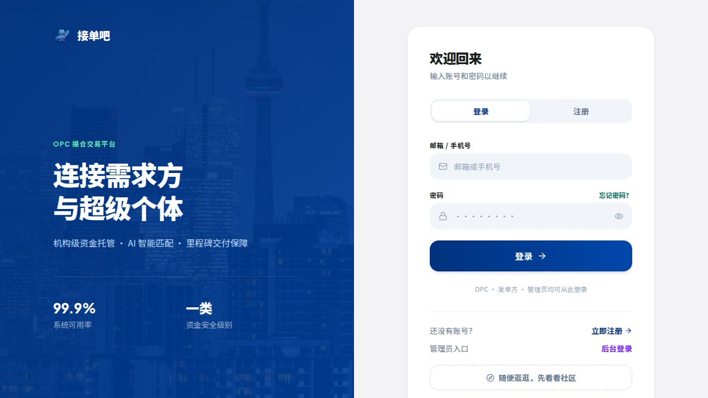

### 登录步骤

1. 访问平台登录页 `/login`。
2. 点击页面底部「**后台登录**」文字链接，切换至管理员登录入口。
3. 输入管理员账号（邮箱）和密码，点击「登录 →」。
4. 验证通过后，系统自动跳转至管理后台首页（数据看板）。

> **安全提醒**：管理员账号启用了登录频率限制（15 分钟内最多 20 次尝试），多次失败后将触发临时锁定，请确保输入正确的凭据。

### 账号安全建议

- 使用**独立且高强度的密码**（至少 12 位，含大小写字母、数字和特殊字符）。
- 不同设备共享账号时，请在完成操作后立即退出登录。
- 如怀疑账号被盗用，立即修改密码并联系技术支持。

---

## 三、数据看板

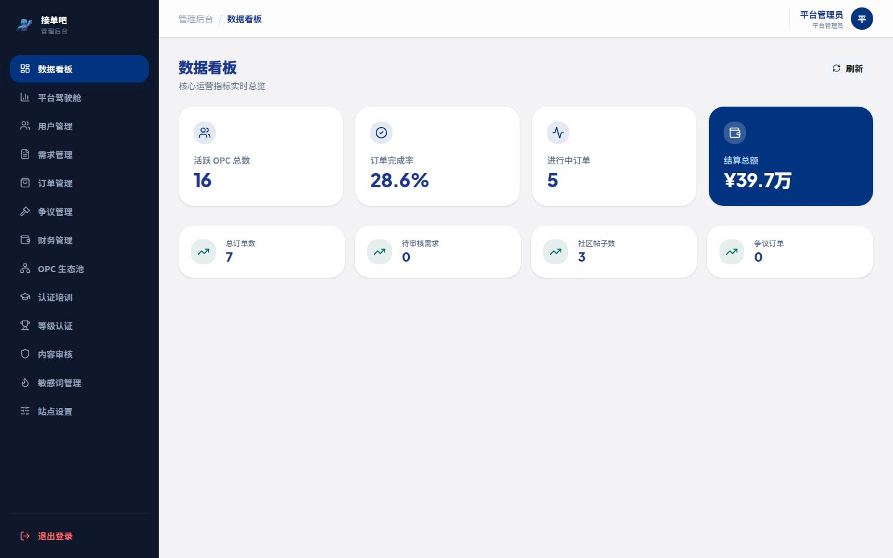

登录后默认进入数据看板，这是平台**运营健康度的实时总览**。

### 核心 KPI 卡片

页面顶部蓝色横幅展示四项关键运营指标：

| 指标 | 说明 | 预警参考 |
|------|------|----------|
| **活跃 OPC 总数** | 当前平台活跃的已认证 OPC 数量 | 低于基准值需关注 OPC 流失 |
| **订单完成率** | 成功结案订单占总订单的百分比 | 低于 85% 需排查执行异常 |
| **进行中订单** | 当前正在执行的项目数量 | 异常激增需排查批量操作 |
| **结算总额** | 平台历史累计结算金额（万元） | 核心业务规模指标 |

### 次级指标

| 指标 | 说明 |
|------|------|
| **总订单数** | 平台历史所有订单总量 |
| **待审核需求** | 当前排队等待审核的需求数量（越少越好） |
| **社区帖子数** | 平台社区累计内容量 |
| **争议订单** | 当前处于争议状态的订单数（需及时处理） |

> **操作建议**：每个工作日上午开始前先查看数据看板，重点关注「待审核需求」和「争议订单」两项，确保无积压处理。

---

## 四、平台驾驶舱

平台驾驶舱（侧边栏「平台驾驶舱」）提供更深维度的**运营数据分析图表**，适合每周/每月周期性运营复盘。

### 主要数据维度

- **订单趋势图**：按时间维度展示订单量变化趋势，识别业务增长或下滑信号。
- **需求类型分布**：各类需求（AI教育、政企培训、AI研学等）的占比，指导 OPC 招募方向。
- **OPC 等级分布**：各等级 OPC 数量对比，评估人才供需匹配情况。
- **结算金额走势**：月度结算总额趋势，直观反映平台交易规模变化。
- **用户增长曲线**：OPC 和发单方的新注册用户数趋势对比。

### 使用建议

- 每月初导出驾驶舱数据截图，存入运营档案作为月报素材。
- 发现异常指标（如某类需求突增、某等级 OPC 大量流失），及时分析原因并调整运营策略。

---

## 五、用户管理

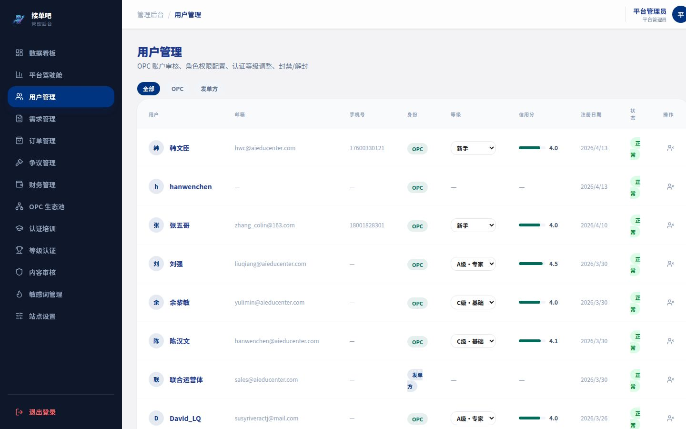

侧边栏「用户管理」是管理所有平台账号的核心模块。

### 用户列表

列表展示所有注册用户，包含以下字段：

| 列名 | 说明 |
|------|------|
| 用户 | 头像 + 昵称 |
| 邮箱 | 注册邮箱 |
| 手机号 | 注册手机号（用于联系确认） |
| 身份 | OPC / 发单方 / 管理员 |
| 等级 | OPC 认证等级（新手 / C级 / B级 / A级） |
| 信用分 | 当前信用评分（满分 10.0） |
| 注册日期 | 账号创建时间 |
| 状态 | 正常 / 封禁 |
| 操作 | 管理操作入口 |

### 按角色筛选

顶部标签「全部」「OPC」「发单方」可快速切换显示对应角色的用户列表。

### 可执行操作

**① 调整 OPC 等级**

- 点击 OPC 用户所在行的等级下拉菜单，可将其切换为：新手 / C级·基础 / B级·进阶 / A级·专家。
- **使用场景**：处理 OPC 等级升级申请，或因违规降级处理。
- **注意**：等级变更将立即影响该 OPC 可接单的需求范围，操作前请确认有充分依据。

**② 封禁 / 解封账号**

- 封禁后，该用户将无法登录平台；解封后恢复正常访问。
- 封禁适用于：违规发布内容、私下交易、恶意刷单、平台投诉核实等情形。
- 建议封禁前在内部记录操作原因，以备查询。

**③ 查看用户详情**

- 点击用户行末「操作」图标，可查看该用户的详细注册信息和历史行为记录。

---

## 六、需求管理

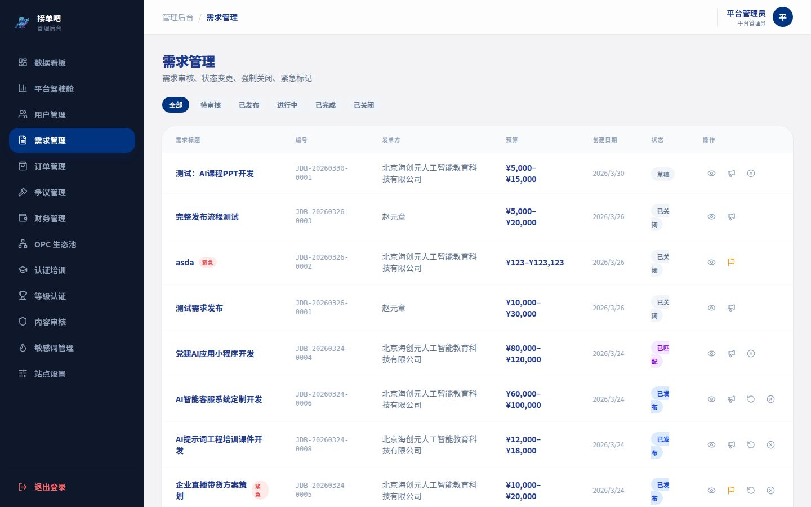

侧边栏「需求管理」负责平台所有需求的**审核与状态管控**，是日常运营最高频的模块之一。

### 状态筛选

顶部标签快速切换：全部 / 待审核 / 已发布 / 进行中 / 已完成 / 已关闭

> **优先处理**：每日开始工作时先切换至「待审核」标签，清空积压的审核队列。

### 需求列表字段

| 列名 | 说明 |
|------|------|
| 需求标题 | 点击可查看完整需求详情 |
| 编号 | 平台唯一编号（如 JDB-20260413-0001） |
| 发单方 | 发布该需求的企业账号 |
| 预算 | 预算区间（元） |
| 创建日期 | 需求创建时间 |
| 状态 | 当前审核/执行状态 |
| 操作 | 审核操作入口 |

### 审核操作

**① 通过审核**

- 点击对应需求行的绿色「✓」按钮。
- 审核通过后需求状态切换为「招募中」，立即向所有符合条件的 OPC 公开展示。
- 审核前请核查：需求描述是否真实合规、预算设置是否与等级要求匹配、是否存在违禁内容。

**② 退回草稿**

- 点击「退回」按钮，需求退回「草稿」状态，发单方收到通知并可修改后重新提交。
- 适用场景：需求描述不清晰、预算异常、内容违规但可修改。
- 操作时建议在系统备注中填写退回原因，帮助发单方理解修改方向。

**③ 强制关闭**

- 点击「关闭」按钮，需求直接进入「已关闭」状态，不再接受报名。
- 适用于：发现严重违规内容、发单方账号已封禁、需求内容无法修改合规。
- **此操作不可逆**，请谨慎执行。

---

## 七、订单管理

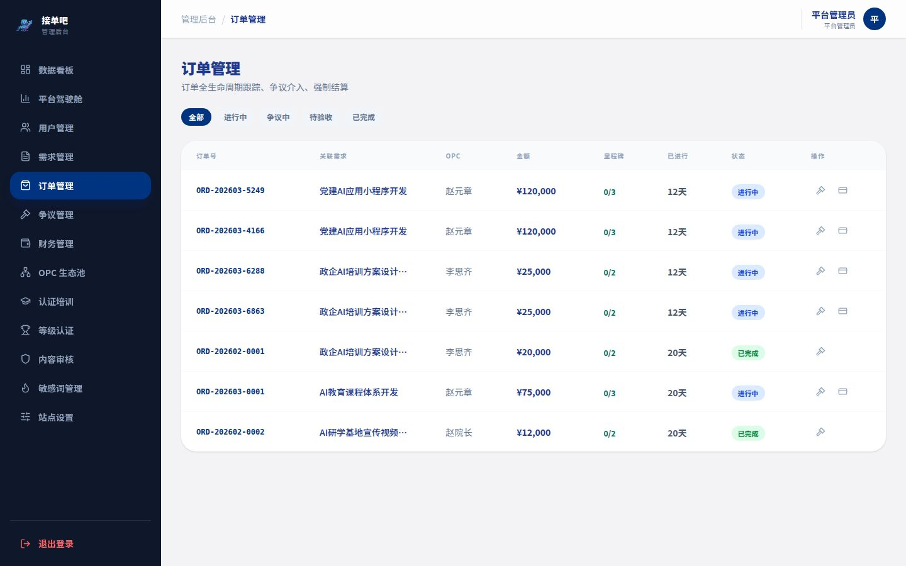

侧边栏「订单管理」提供平台所有订单的**全局监控视图**，管理员不参与具体交付，主要负责监控异常状态。

### 状态筛选

全部 / 进行中 / 争议中 / 待验收 / 已完成

> **重点关注**：「争议中」订单需立即在争议管理模块跟进处理；「进行中」订单超期未更新时需主动联系相关方。

### 订单列表字段

| 列名 | 说明 |
|------|------|
| 订单编号 | 平台唯一编号 |
| 需求名称 | 关联需求标题 |
| 发单方 | 发布该项目的企业账号 |
| OPC | 负责执行的超级个体账号 |
| 金额 | 合同总金额（元） |
| 创建日期 | 订单创建时间 |
| 状态 | 当前执行状态 |

### 异常订单处理

- **长期未更新**：进行中订单超过预设里程碑截止日期 5 天以上仍未提交，主动联系 OPC 和发单方了解情况。
- **资金异常**：发现订单金额与约定不符时，联系技术支持核查数据，切勿自行修改金额字段。

---

## 八、争议管理

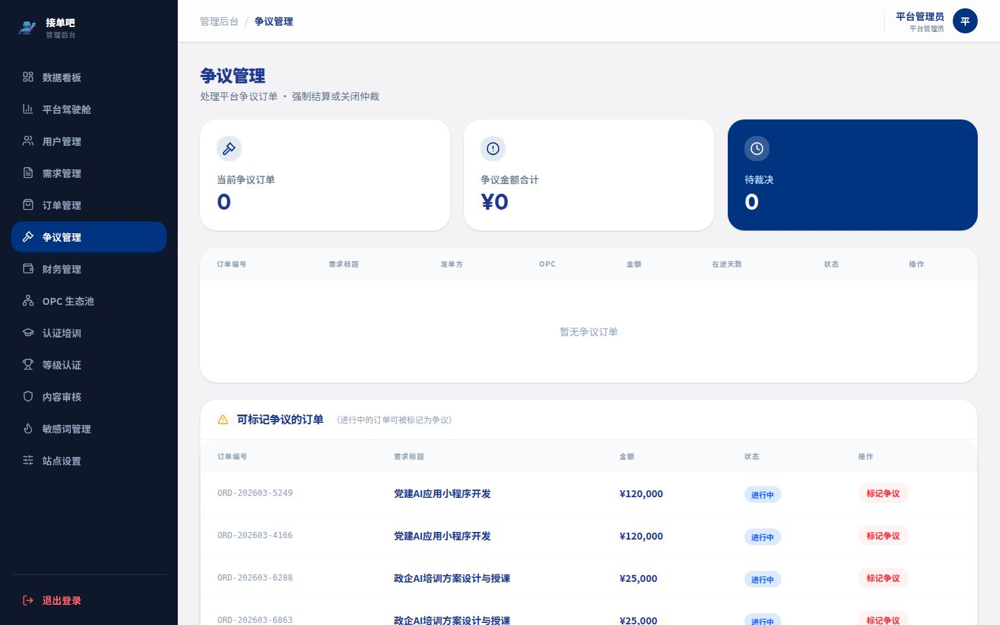

争议管理是管理员最重要的**司法裁量职能**，需保持公正中立原则，在规定时效内完成调解。

### 争议处理原则

1. **中立性**：管理员应基于双方提交的证据客观判断，不因用户等级或历史关系偏袒任何一方。
2. **时效性**：争议申请提交后 **48 小时内**必须开始调查，**5 个工作日内**给出调解结论。
3. **证据优先**：以双方提交的截图、文件、沟通记录为核心依据，双方陈述仅作参考。

### 争议状态说明

| 状态 | 说明 |
|------|------|
| **待处理** | 已收到争议申请，尚未介入 |
| **调查中** | 管理员已介入，正在核查证据 |
| **已结案** | 已发布调解结论 |

### 调解操作流程

1. **查看争议列表**：切换至「待处理」标签，按申请时间排序，优先处理最早的争议。
2. **进入争议详情**：点击争议记录查看：
   - 订单基本信息（编号、金额、里程碑进度）
   - 申请方（OPC 或发单方）提交的争议原因和证据
   - 对方提交的回应材料
3. **核查证据**：
   - 核对里程碑约定的交付物标准与 OPC 实际提交内容是否匹配。
   - 核查双方提交的沟通记录截图是否存在矛盾。
   - 如证据不足，可通过系统消息向双方追加索取材料。
4. **发布调解结论**：在「调解结论」文本框中填写结论内容，选择处理方式：
   - **支持申请方**：认定被申请方违约，资金按比例重新分配。
   - **驳回申请**：认定申请方理由不成立，维持原有执行状态。
   - **按比例分摊**：双方均有责任，协商比例分配托管资金。
5. **提交结论**：结论提交后系统自动通知双方，并按结论执行资金操作。

### 常见争议类型与处理参考

| 争议类型 | 核查重点 | 常见结论 |
|----------|----------|----------|
| OPC 交付物不达标 | 需求里程碑描述 vs OPC 提交内容对比 | 要求 OPC 返工或按比例退款 |
| 发单方无故拒绝验收 | 驳回次数、驳回理由是否具体 | 支持 OPC，释放对应里程碑资金 |
| OPC 超时未提交 | 里程碑截止时间 vs 最后提交时间 | 根据超时程度和沟通记录判定 |
| 范围争议（超出合同） | 需求原始描述 vs OPC 执行内容 | 以原始需求描述为准 |

---

## 九、财务管理

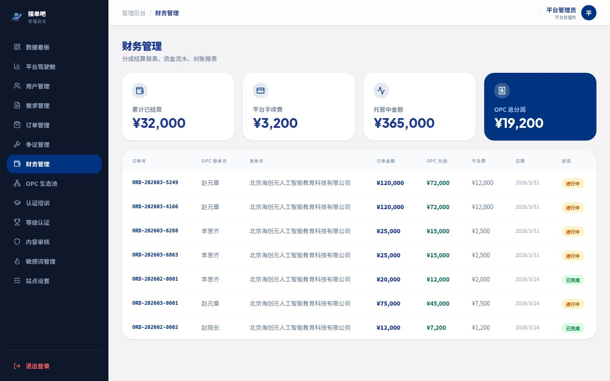

侧边栏「财务管理」提供平台完整的**资金流水监控视图**，管理员拥有只读查看权限。

### 平台财务概览

| 指标 | 说明 |
|------|------|
| **平台总托管资金** | 当前所有进行中项目的托管资金总额 |
| **历史结算总额** | 平台成立以来累计完成结算的资金总量 |
| **本月新增结算** | 本月已完成结算的金额 |
| **待结算金额** | 已验收但结算中的资金总额 |

### 结算明细查询

以表格形式列出所有结算记录，支持按以下条件筛选：

- 时间范围（按月 / 自定义区间）
- 结算状态（进行中 / 已完成 / 争议中）
- 用户账号（按 OPC 或发单方搜索）

### 结算规则（平台设定）

- OPC 分成比例：订单金额的 **90%**
- 平台服务费：订单金额的 **10%**
- 结算周期：验收通过后 **3 个工作日内**自动到账

> **财务异常处理**：如发现资金数据异常（金额错误、重复结算等），请立即联系技术支持，切勿尝试通过后台直接修改数据。

---

## 十、OPC 生态池

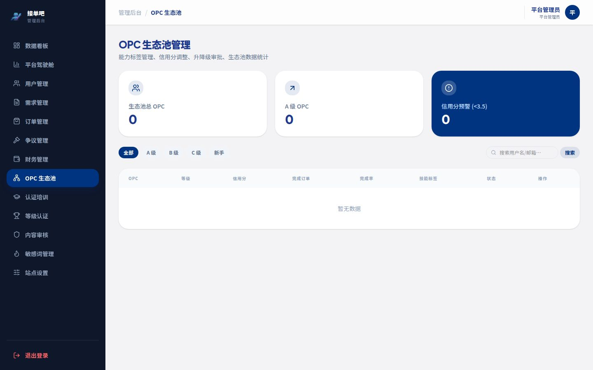

侧边栏「OPC 生态池」为管理员提供平台 OPC 人才总库的**宏观视图**，用于生态健康度监控和人才结构分析。

### OPC 分布数据

- **等级分布饼图**：各等级（C/B/A）OPC 数量及占比，评估人才梯度是否健康。
- **技能热力图**：各技能标签的 OPC 覆盖情况，识别供给不足的技能方向。
- **活跃度分布**：活跃 / 半活跃 / 沉默 OPC 比例，指导 OPC 运营激活策略。

### OPC 列表与搜索

- 可按等级、技能标签、状态过滤查看所有 OPC。
- 支持按昵称或邮箱关键词搜索定位具体 OPC 账号。
- 点击 OPC 卡片查看其完整资料，并快捷跳转至「用户管理」进行操作。

---

## 十一、认证培训管理

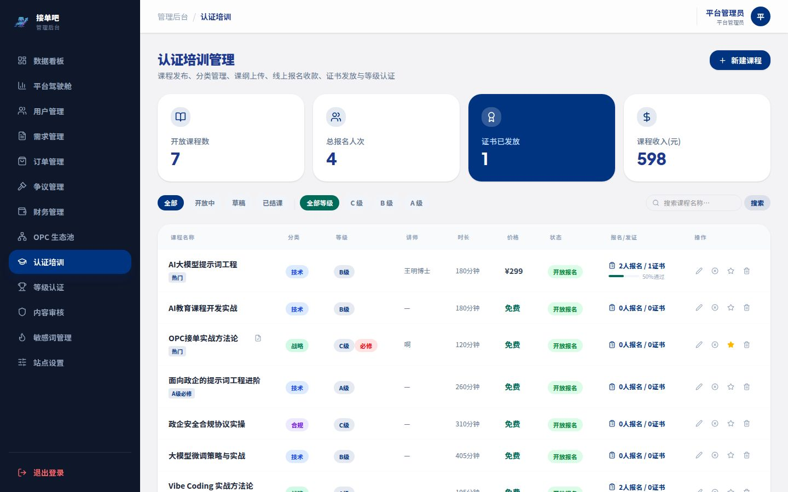

侧边栏「认证培训」负责管理平台提供给 OPC 的**培训课程体系**，包括课程上架、内容管理和定价维护。

### 课程列表

列出所有已上架和草稿状态的培训课程，字段包含：课程名称、适用等级、时长、定价、状态（已发布/草稿/已下架）、报名人数。

### 新增课程

点击「+ 新建课程」：

| 字段 | 说明 | 备注 |
|------|------|------|
| 课程名称 | 课程标题 | 必填 |
| 适用等级 | C / B / A 级 | 必填 |
| 课程简介 | 学习目标和内容概要 | 必填，建议 100-200 字 |
| 学习时长 | 预计完成时间（小时） | 必填 |
| 价格 | 0 为免费，填写正整数为收费 | 必填 |
| 课程链接 | 外部课程平台 URL 或内嵌视频地址 | 选填 |
| 封面图 | 课程卡片展示图 | 选填 |

### 课程状态管理

- **草稿** → **发布**：点击发布后，OPC 在培训页可见并可报名。
- **发布** → **下架**：下架后 OPC 不可见，已报名学员不受影响。
- 修改课程信息（包括价格）会立即生效，建议调整前做好公告。

---

## 十二、等级认证管理

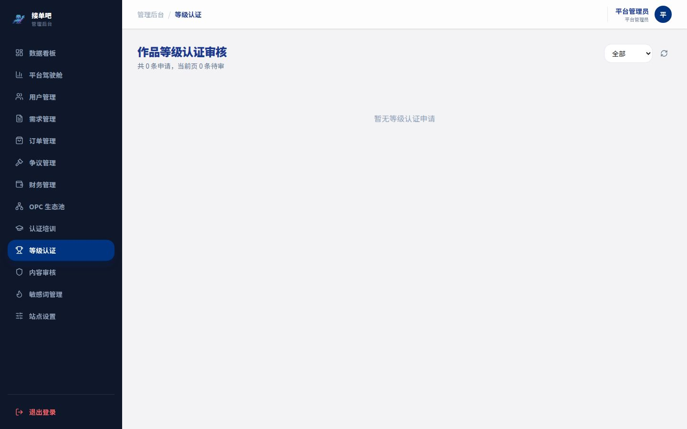

侧边栏「等级认证」管理 OPC 提交的**等级升级申请**，审核通过后自动更新该 OPC 的认证等级。

### 申请列表字段

| 列名 | 说明 |
|------|------|
| OPC | 申请人昵称和头像 |
| 当前等级 | 申请人当前认证等级 |
| 申请等级 | 目标升级等级 |
| 申请时间 | 提交申请的时间 |
| 支撑材料 | 申请人提交的作品集、证书、历史订单等证明材料链接 |
| 状态 | 待审核 / 已通过 / 已拒绝 |

### 审核标准参考

| 升级目标 | 建议核查内容 |
|----------|-------------|
| **C → B（进阶）** | 完成平台指定进阶课程；累计完成 3 个以上订单；综合评分 ≥ 4.0 |
| **B → A（专家）** | 完成平台专家课程认证；累计完成 10 个以上订单；综合评分 ≥ 4.5；无违规记录 |

### 审核操作

- **通过**：点击「通过」，OPC 等级立即升级，系统自动发送升级通知。
- **拒绝**：点击「拒绝」并填写拒绝原因，OPC 可针对意见补充材料后重新申请。

---

## 十三、内容审核

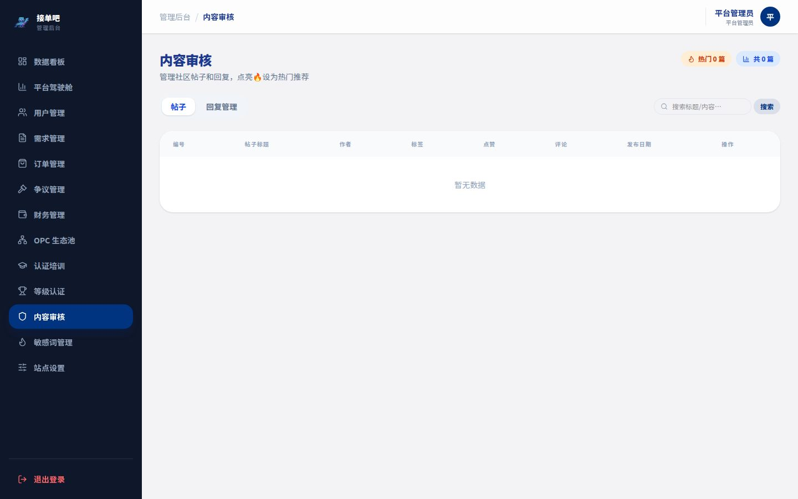

侧边栏「内容审核」负责平台社区帖子的**人工审核和内容治理**，维护平台内容生态健康。

### 审核队列

- 社区新帖默认进入待审核队列，通过后公开展示。
- 列表展示：发布者、帖子标题摘要、发布时间、标签、系统风控预警等级（正常/疑似违规/高风险）。

> **处理优先级**：高风险预警帖子优先审核，建议当日清空队列。

### 审核操作

**① 通过**

- 内容合规，可公开展示于社区。

**② 拒绝（删除）**

- 内容违规，不予展示，发布者收到违规提示。
- 以下内容必须拒绝：含个人联系方式（电话/微信/QQ）、私下交易引导、政治敏感内容、广告营销、虚假信息。

**③ 预警内容快速定位**

- 系统会对包含敏感词的帖子标注「高风险」预警，重点核查。
- 如系统误判，通过后可正常公开。

---

## 十四、敏感词管理

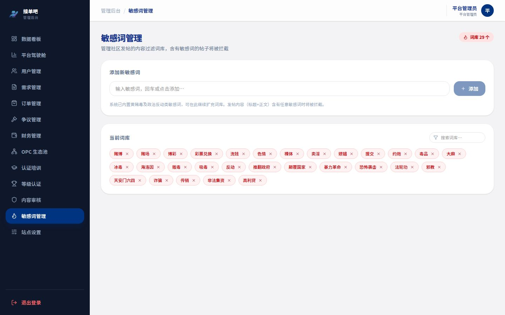

侧边栏「敏感词管理」维护平台的**违禁关键词库**，用于自动过滤用户发布的违规内容。

### 敏感词列表

以分类标签展示当前词库中所有敏感词：

- **联系方式类**：如"微信号"、"加我"、"私聊"（防止私下交易）
- **违规交易类**：如"私下转账"、"不走平台"（防止绕过平台交易）
- **政治敏感类**：根据法规要求维护（不在此列举）
- **广告垃圾类**：如"优惠券"、"扫码领"等营销词汇

### 添加敏感词

1. 点击「+ 添加」按钮。
2. 输入敏感词或短语（支持精确匹配和模糊匹配两种模式）。
3. 选择分类标签（联系方式 / 违规交易 / 其他）。
4. 保存后立即生效，用户发布内容时系统自动检测。

### 删除敏感词

- 点击词库中某条词旁的「删除」图标，确认后从词库移除。
- 删除前请确认该词不再具有违规含义，避免误删导致漏审。

> **维护建议**：每月底审查词库，根据新出现的规避词汇（如变体写法、缩写）及时扩充词库。

---

## 十五、站点设置

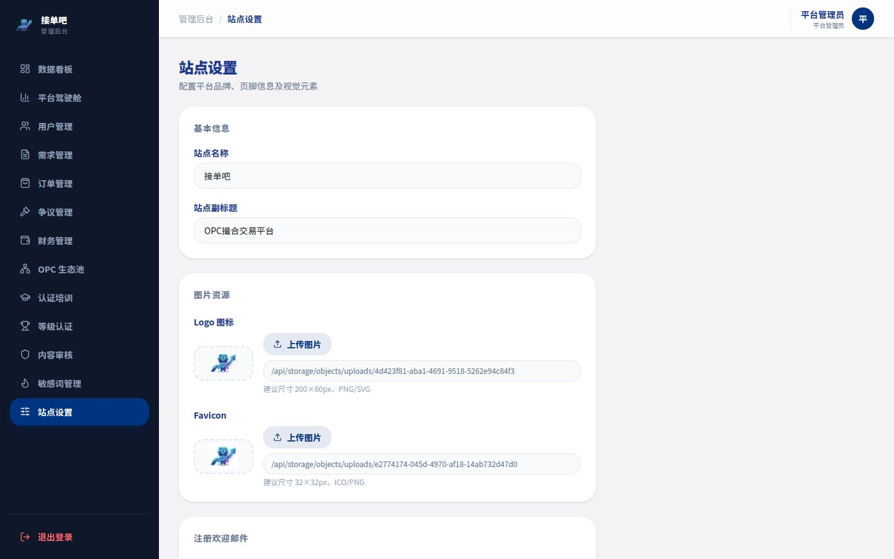

侧边栏「站点设置」提供平台全局配置参数的管理入口。

### 主要配置项

| 配置项 | 说明 | 注意事项 |
|--------|------|----------|
| **平台名称** | 显示于浏览器标签和页面顶部 | 修改后立即生效，影响所有用户界面 |
| **平台简介** | SEO 描述文本 | 影响搜索引擎收录展示 |
| **服务费比例** | 平台从订单中收取的服务费百分比（当前 10%） | **修改需极谨慎**，仅影响新订单，历史订单不变 |
| **结算周期** | 验收通过后到结算的工作日数（当前 3 天） | 修改需提前公告，避免引发 OPC 投诉 |
| **联系邮箱** | 平台官方客服邮箱，显示于各类通知邮件 | 确保邮箱实际可用 |
| **维护模式** | 开启后普通用户无法访问，仅管理员可登录 | 用于系统升级期间，操作需谨慎 |

> ⚠️ **高危操作提醒**：服务费比例和维护模式修改会直接影响所有用户体验，操作前请确认已通过内部审批，并提前在社区发布公告。

---

## 十六、运营规范与安全注意事项

### 日常运营 SLA

| 任务 | 处理时限 |
|------|----------|
| 需求审核 | 提交后 **1-2 个工作日**内完成 |
| 争议介入 | 申请提交后 **48 小时**内介入 |
| 争议结案 | 介入后 **5 个工作日**内给出结论 |
| 等级认证审核 | 申请后 **3 个工作日**内完成 |
| 内容审核队列 | 每工作日清空队列（当日帖子当日审）|

### 数据安全

- **禁止**将用户手机号、邮箱等个人信息截图或记录后对外分享。
- **禁止**在未授权的情况下对外披露平台财务数据。
- 管理后台操作日志由系统自动记录，保留时间不少于 180 天。

### 账号安全

- 管理员账号**严禁共享**给非运营团队成员。
- 密码至少每 **90 天**更换一次。
- 如发现账号被他人登录，立即修改密码并通知技术支持查询登录日志。

### 封禁操作规范

- **临时封禁**（1-7天）：适用于首次违规或轻微违规，给予警告性处罚。
- **永久封禁**：适用于严重违规（私下交易、诈骗、多次违规累积），需记录完整违规事实。
- 所有封禁操作应在内部协作文档中留档，注明封禁原因和处理人。

---

## 十七、常见问题 FAQ

### 需求审核

**Q：发单方提交的需求描述不清晰，但也不算违规，应该通过还是退回？**  
A：建议退回，并在退回原因中说明具体需要补充或澄清的内容（如预算与等级不匹配、交付里程碑缺失等）。清晰的需求描述有利于 OPC 准确报价，降低后续争议概率。

**Q：同一个发单方短期内反复提交相同内容的需求，如何处理？**  
A：先核查该发单方的历史订单记录，若存在恶意测试或骚扰行为，可退回需求并在用户管理中记录警告。如情节严重，上报后考虑临时限制其发单权限。

---

### 争议调解

**Q：双方证据旗鼓相当、无法判断是非，怎么办？**  
A：可按争议金额的 50/50 比例分配托管资金，并在调解结论中说明"双方均有改进空间"，给双方信用分各扣 0.5 分，以示警示。此做法为兜底方案，尽量通过细查证据避免使用。

**Q：OPC 和发单方都联系不上，争议一直挂起，如何处理？**  
A：在争议详情中记录联系尝试（时间和方式），若 5 个工作日内任何一方均无回应，可依据现有证据单方面作出调解决定，并在结论中注明情况。同时将长期失联账号推送至用户管理模块做进一步处理。

---

### 账号与权限

**Q：发现有 OPC 用两个账号接同一个需求，怎么处理？**  
A：核实两个账号的注册信息（手机号、邮箱、IP 地址），确认为同一人后，封禁其中一个账号，并在用户管理中对主账号记录警告，如有恶意竞价行为可考虑临时封禁主账号。

**Q：发单方要求平台强制更换项目执行的 OPC，可以操作吗？**  
A：平台不支持管理员强制替换 OPC，这属于合同变更。如双方协商一致需更换执行方，应先结束当前订单（可通过协商关闭），重新发布需求并选定新 OPC。如存在争议，按争议处理流程操作。

---

### 财务与结算

**Q：OPC 反映结算迟迟未到账，如何排查？**  
A：在财务管理中查询该订单的结算记录，确认结算状态。如显示"已结算"但 OPC 未收到，需核查 OPC 的结算账户银行信息是否正确（在结算账户模块查看），如账户信息有误需联系技术支持补录正确信息后重新结算。

**Q：管理员可以直接修改订单金额吗？**  
A：不可以。订单金额一经签约即为合同约定金额，管理员后台无权修改。如确需调整，需通过技术支持发起数据库操作申请，且须经过内部双重审批。
